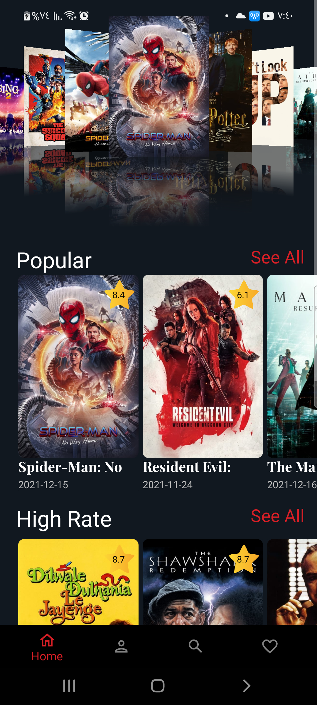
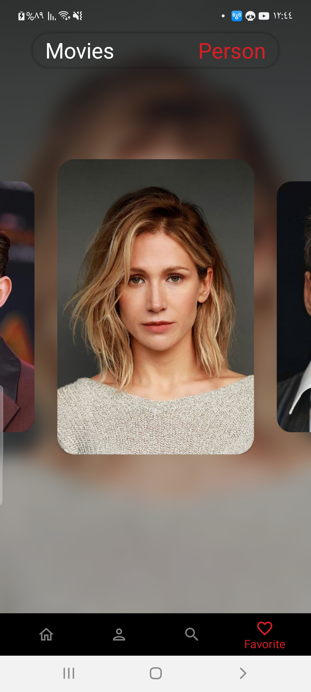
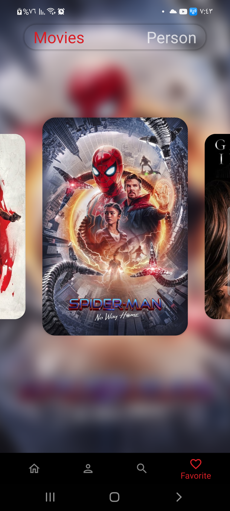
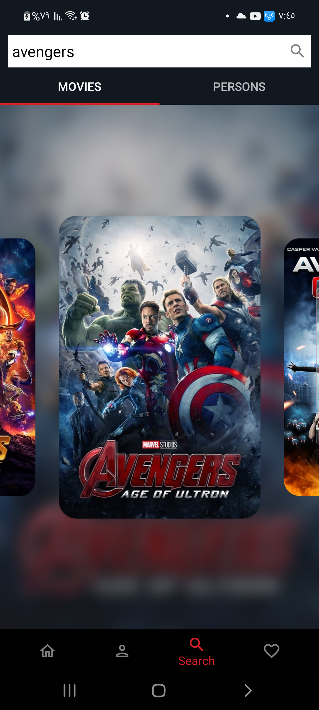
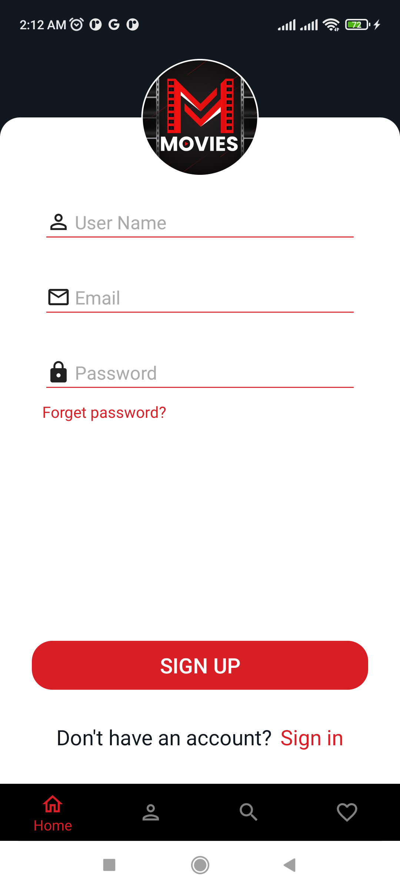

# Show-Time
Movies App by MVVM, Coroutines, Retrofit, Navigation Component, ExoPlayer, Coil and Firebase

 

## Screens
Home | Movies Details | Movies List | Person List | Actor Details | Favorite Actors  
--- | --- | --- | --- | --- | ---  
 |  |  |  |  | 

 

Favorite Movies | Search Movies | Sign in | Sign Up | Actor Details collapsed | Trailer  
--- | --- | --- | --- | --- | --- 
 |   |  |  |  | 

 

## Built With 🛠
- [Kotlin](https://kotlinlang.org/) - First class and official programming language for Android development.
- [Coroutines](https://kotlinlang.org/docs/reference/coroutines-overview.html) - For asynchronous and more..
- [Android Architecture Components](https://developer.android.com/topic/libraries/architecture) - Collection of libraries that help you design robust, testable, and maintainable apps.
  - [LiveData](https://developer.android.com/topic/libraries/architecture/livedata) - LiveData is an observable data holder class. Unlike a regular observable, LiveData is lifecycle-aware, meaning it respects the lifecycle of other app components.
  - [ViewModel](https://developer.android.com/topic/libraries/architecture/viewmodel) - Stores UI-related data that isn't destroyed on UI changes.
  - [Jetpack Navigation](https://developer.android.com/guide/navigation) - Navigation refers to the interactions that allow users to navigate across, into, and back out from the different pieces of content within your app
- [Material Components for Android](https://github.com/material-components/material-components-android) - Modular and customizable Material Design UI components for Android.
- [Third party libraries] - Collection of libraries that help you design robust, testable, and maintainable apps.
   - [Coil](https://coil-kt.github.io/coil/) - An image loading library for Android backed by Kotlin Coroutines.
   - [Retrofit](https://square.github.io/retrofit/) - A type-safe HTTP client for Android and Java.
   - [ExoPlayer](https://developer.android.com/guide/topics/media/exoplayer) - is an application level media player for Android. It provides an alternative to Android’s MediaPlayer API for playing audio and video both locally and over the Internet.
- [Firebase](https://firebase.google.com/) - helps you build and run successful apps.

 

## Architecture 🗼
This app uses [***MVVM (Model View View-Model)***](https://developer.android.com/jetpack/docs/guide#recommended-app-arch) architecture.

## Contribute 🤝
If you want to contribute to this app, you're always welcome!

 

## Contact 📩
Have an project? DM us at 👇

Drop a mail to:- hamdyabdelfattah14@gmail.com

 

 

